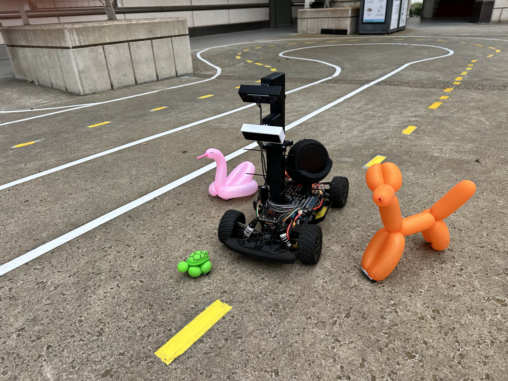
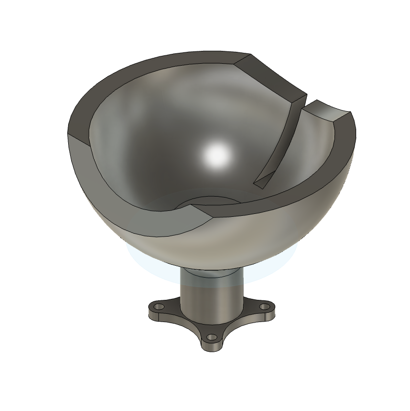
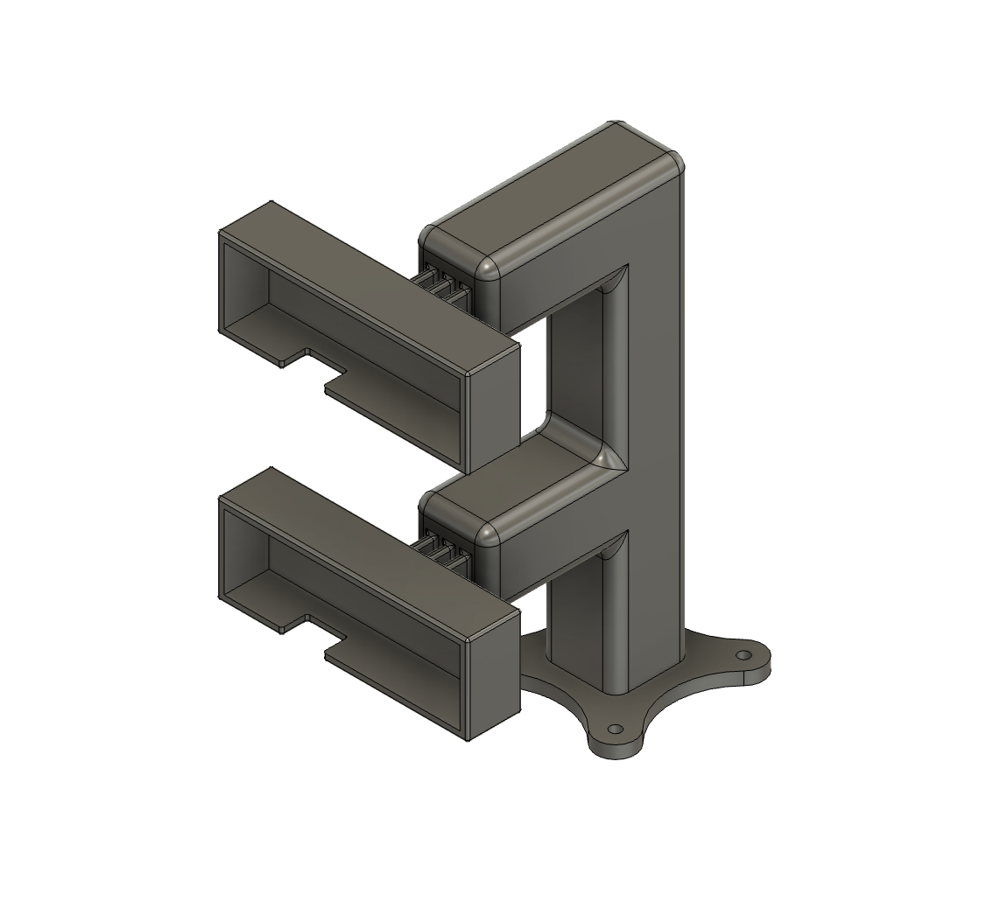
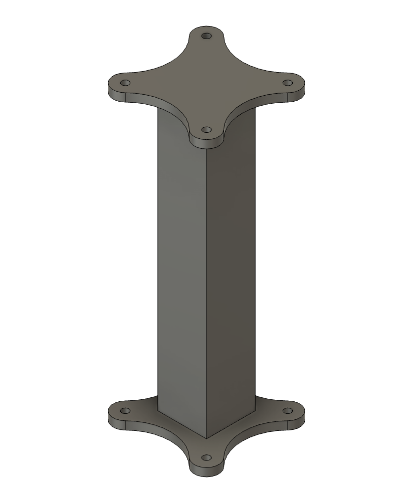
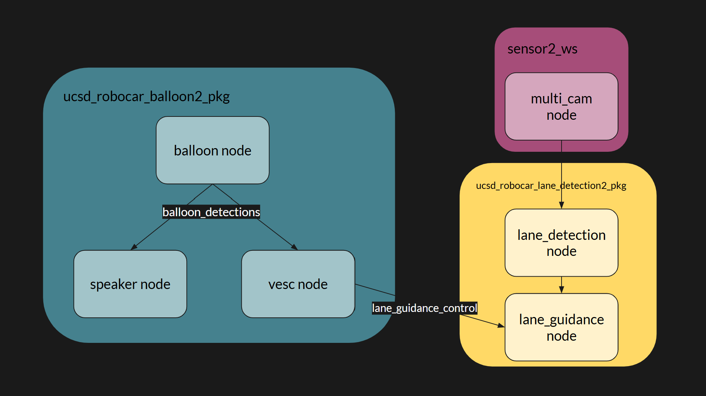
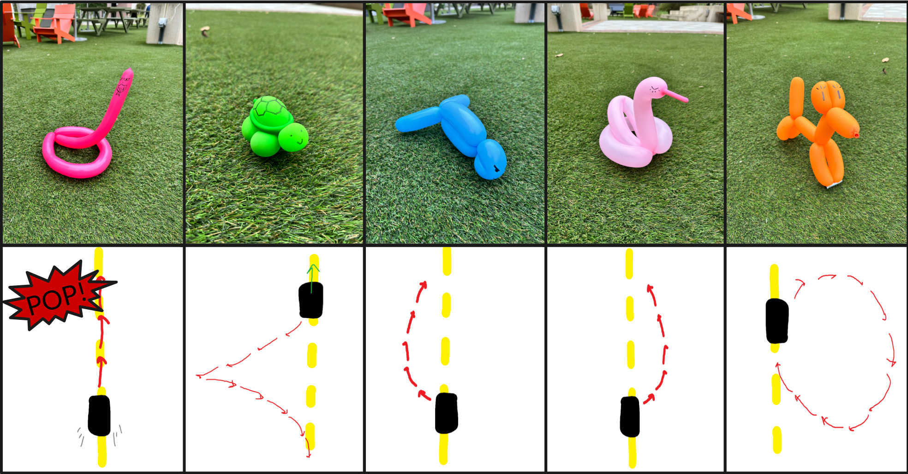

# ECE 148 Spring 2025 Team 11 Final Project
## "Balloon Animals"



[Final Presentation](https://docs.google.com/presentation/d/1dCoKgqVfZQMhyggTEogI8tUQDtrG1OyyUPlr59H-XTo/edit?usp=sharing)

## Members
Jose Arreguin -- Mathematics: Computer Science

Kenny Huh -- Mechanical Engineering

Leonardo Hartl -- Mechanical Engineering

Nicolas Ventos -- Aerospace Engineering

## Project Description
We have built a car that autonomously recognizes randomly placed target balloon animals. It responds differently depending on the identified animal, all while following a designated path in a ***controlled and optimal manner***.

### Main Objectives
- Detection of various balloon animals via Roboflow object detection model
- Different actions based on which balloon animal is detected
- Speaker plays sounds corresponding to each balloon animal
- Above nodes running in parallel with OpenCV lane following

### Nice to have
- LiDAR integration for more refined movement


# Design Components

| Component | Designer |
|-----------|----------|
|Speaker Mount|Nicolas|
|Dual Camera Mount|Kenny|
|Camera Extension|Kenny|

## Component Images
**Speaker Mount Design**



**Dual Camera Mount Design**



**Camera Extension Design**



# Software

## System Architecture Overview



### Implementation Details
We created our own package named ucsd_robocar_balloon2_pkg that contains our main nodes (balloon, speaker and vesc)

#### `balloon_node.py`
- handles the balloon detection with the OAKD camera specified by its MXID (bottom camera).
- MXID passed through the launch file parameters
- *publishes* to the *balloon_detections* topic, which baloon animal it detected or *none* if it has detected nothing

#### `speaker_node.py`
- *subscribes* to the *balloon_detections* topic, which using the recieved detected animal, plays the corresponding audio via the aplay command:
```
		try: 
			subprocess.run(
				['aplay', '-D', 'plughw:2,0', sound_path],
				check=True
			)
		except subprocess.CalledProcessError as e:
			self.get_logger().error(f"Failed to play audio: {e}")
```

#### `vesc_node.py`
- *subscribes* to the *balloon_detections* topic and recieves the detected animal.
- It then *publishes* **pause** to the *lane_guidance_control* which switches the state of the lane guidance node to halt sending values to the VESC.
- Then it controls the car in a specified manner:



- Finally it *publishes* **resume** to the *lane_guidance_control* topic which reverts the lane guidance node to a normal state.

#### `multi_cam_node.py`
- configured to only use one camera specified by its MXID (top camera).
- We had to run this every time before launch:
```
cd /home/projects/sensor2_ws
colcon build --packages-select multi_cam
source install/setup.bash
build_ros2
```

#### `lane_guidance_node.py`
- *subscribes* to the *lane_guidance_control* and switches its state depending on whether it recieves a **pause** or a **resume**. 
- In the pause state it does not send commands to the vesc. 
- In resume state it works as normal.